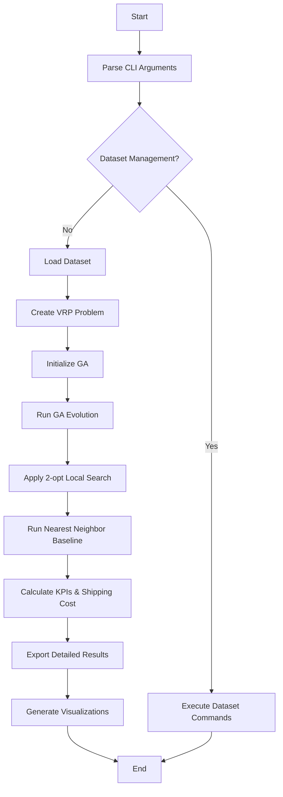
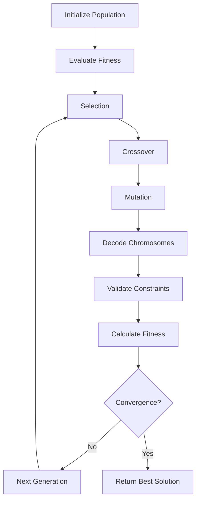
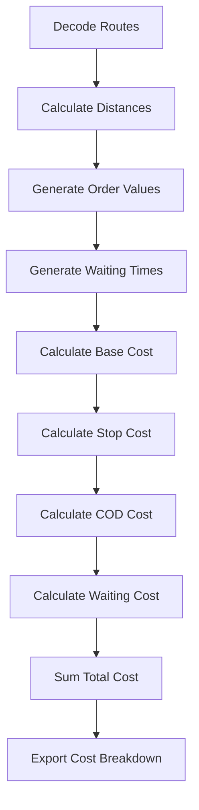

# KIẾN TRÚC VÀ WORKFLOW HỆ THỐNG VRP-GA

## Tổng quan hệ thống

VRP-GA System là một hệ thống giải quyết bài toán Vehicle Routing Problem (VRP) sử dụng thuật toán di truyền (Genetic Algorithm) với các tính năng nâng cao:

- **Thuật toán di truyền** với tối ưu hóa 2-opt local search
- **Tính phí giao hàng thực tế** theo mô hình Ahamove
- **Visualization đa dạng**: Map Hà Nội tương tác + Traditional plots
- **Batch processing** cho Solomon datasets
- **Xuất kết quả chi tiết** với evolution data và KPI comparison

## Kiến trúc hệ thống

### 1. Kiến trúc tổng thể

```
┌─────────────────────────────────────────────────────────────┐
│                    VRP-GA SYSTEM                           │
├─────────────────────────────────────────────────────────────┤
│  Presentation Layer (CLI Interface)                        │
│  ├── main.py (Entry point)                                │
│  └── CLI Arguments & Configuration                        │
├─────────────────────────────────────────────────────────────┤
│  Business Logic Layer                                      │
│  ├── Data Processing                                      │
│  ├── Algorithm Engine                                     │
│  ├── Evaluation & Metrics                                 │
│  └── Visualization                                        │
├─────────────────────────────────────────────────────────────┤
│  Data Layer                                                │
│  ├── JSON Datasets                                        │
│  ├── Distance Matrices                                     │
│  └── Configuration Files                                  │
└─────────────────────────────────────────────────────────────┘
```

### 2. Kiến trúc chi tiết theo module

```
src/
├── data_processing/          # Xử lý dữ liệu
│   ├── json_loader.py       # Load JSON datasets
│   ├── dataset_converter.py # Convert Solomon CSV → JSON
│   ├── generator.py         # Generate mockup data
│   ├── distance.py          # Calculate distance matrices
│   ├── constraints.py       # Handle VRP constraints
│   └── enhanced_hanoi_coordinates.py # Hanoi coordinate generation
│
├── models/                  # Mô hình dữ liệu
│   ├── vrp_model.py         # VRP problem representation
│   └── solution.py          # Solution representation
│
├── algorithms/              # Thuật toán
│   ├── genetic_algorithm.py # GA engine
│   ├── operators.py         # GA operators (selection, crossover, mutation)
│   ├── fitness.py           # Fitness evaluation
│   ├── decoder.py           # Chromosome → Routes decoder
│   ├── local_search.py      # 2-opt optimization
│   └── nearest_neighbor.py  # Baseline heuristic
│
├── evaluation/              # Đánh giá và metrics
│   ├── metrics.py           # KPI calculation
│   ├── comparator.py        # Solution comparison
│   ├── validator.py         # Solution validation
│   ├── result_exporter.py   # Export detailed results
│   └── shipping_cost.py     # Shipping cost calculation
│
└── visualization/           # Visualization
    ├── mapper.py            # Route mapping
    ├── plotter.py           # Traditional plots
    ├── reporter.py          # Report generation
    └── enhanced_hanoi_map.py # Hanoi map visualization
```

## Workflow hệ thống

### 1. Workflow tổng thể



### 2. Workflow chi tiết GA



### 3. Workflow tính phí giao hàng



## Cấu trúc dữ liệu

### 1. VRP Problem Structure

```python
VRPProblem:
├── depot: Customer          # Điểm depot
├── customers: List[Customer] # Danh sách khách hàng
├── vehicle_capacity: float   # Sức chứa xe
├── num_vehicles: int        # Số lượng xe
├── distance_matrix: np.array # Ma trận khoảng cách
└── id_to_index: dict        # Mapping ID → Index
```

### 2. Solution Structure

```python
Individual:
├── chromosome: List[int]     # Chuỗi gen (permutation)
├── fitness: float           # Độ thích nghi
├── routes: List[List[int]]  # Các tuyến đường
├── total_distance: float    # Tổng khoảng cách
├── is_valid: bool           # Tính hợp lệ
└── penalty: float           # Hình phạt vi phạm ràng buộc
```

### 3. Shipping Cost Structure

```python
ShippingCostData:
├── total_cost: float        # Tổng phí giao hàng
├── route_costs: List[Dict]  # Phí từng tuyến
│   ├── base_cost: float     # Phí cơ bản
│   ├── distance_cost: float # Phí khoảng cách
│   ├── stop_cost: float     # Phí điểm dừng
│   ├── cod_cost: float      # Phí COD
│   ├── waiting_cost: float  # Phí chờ
│   └── total_cost: float    # Tổng phí tuyến
└── service_type: str        # Loại dịch vụ
```

## Luồng xử lý chính

### 1. Khởi tạo hệ thống

```python
# 1. Parse arguments
args = create_argument_parser().parse_args()

# 2. Load dataset
loader = JSONDatasetLoader()
data, distance_matrix = loader.load_dataset_with_distance_matrix(
    dataset_name, traffic_factor, dataset_type
)

# 3. Create VRP problem
problem = create_vrp_problem_from_dict(data, distance_matrix)
```

### 2. Chạy thuật toán GA

```python
# 1. Initialize GA
ga = GeneticAlgorithm(problem, ga_config)

# 2. Run evolution
ga_solution, evolution_data = ga.evolve()

# 3. Apply local search
optimizer = TwoOptOptimizer(problem)
ga_solution = optimizer.optimize_individual(ga_solution)

# 4. Run baseline
nn_heuristic = NearestNeighborHeuristic(problem)
nn_solution = nn_heuristic.solve()
```

### 3. Tính toán và xuất kết quả

```python
# 1. Calculate KPIs
kpi_calculator = KPICalculator(problem)
ga_kpis = kpi_calculator.calculate_kpis(ga_solution, execution_time)

# 2. Export detailed results
exporter = ResultExporter(output_dir)
exporter.export_evolution_data(evolution_data)
exporter.export_optimal_routes(ga_solution, problem)
exporter.export_kpi_comparison(ga_solution, nn_solution, problem, ga_stats, nn_stats)

# 3. Generate visualizations
report_generator = ReportGenerator(problem)
report_generator.generate_comprehensive_report(ga_solution, nn_solution, ga_stats, convergence_data, output_dir)
```

## Các thành phần core

### 1. Genetic Algorithm Engine

**File**: `src/algorithms/genetic_algorithm.py`

**Chức năng chính**:

- Quản lý quần thể (Population Management)
- Vòng lặp tiến hóa (Evolution Loop)
- Thu thập dữ liệu tiến hóa (Evolution Data Collection)
- Kiểm tra hội tụ (Convergence Check)

**Các phương thức quan trọng**:

- `evolve()`: Chạy quá trình tiến hóa
- `_create_next_generation()`: Tạo thế hệ tiếp theo
- `_calculate_diversity()`: Tính đa dạng quần thể

### 2. Shipping Cost Calculator

**File**: `src/evaluation/shipping_cost.py`

**Chức năng chính**:

- Tính phí theo mô hình Ahamove
- Xử lý các loại phí (cơ bản, COD, chờ, điểm dừng)
- Tích hợp với VRP solutions

**Các phương thức quan trọng**:

- `calculate_route_cost()`: Tính phí cho một tuyến
- `calculate_solution_cost()`: Tính phí cho toàn bộ giải pháp
- `generate_order_values()`: Tạo giá trị đơn hàng

### 3. Result Exporter

**File**: `src/evaluation/result_exporter.py`

**Chức năng chính**:

- Xuất evolution data (CSV)
- Xuất optimal routes (TXT)
- Xuất KPI comparison (CSV)
- Xuất Solomon batch summary (CSV)

**Các phương thức quan trọng**:

- `export_evolution_data()`: Xuất dữ liệu tiến hóa
- `export_optimal_routes()`: Xuất lộ trình tối ưu
- `export_kpi_comparison()`: Xuất so sánh KPI

### 4. Enhanced Hanoi Map Visualizer

**File**: `src/visualization/enhanced_hanoi_map.py`

**Chức năng chính**:

- Tạo map Hà Nội tương tác với Folium
- Hỗ trợ real routes (OSRM) và straight lines
- So sánh GA vs NN solutions

**Các phương thức quan trọng**:

- `create_map()`: Tạo map cho một solution
- `create_comparison_map()`: Tạo map so sánh
- `_get_osrm_route()`: Lấy tuyến đường thực tế

## Cấu hình hệ thống

### 1. GA Configuration

```python
GA_CONFIG = {
    'population_size': 100,      # Kích thước quần thể
    'generations': 500,          # Số thế hệ
    'crossover_prob': 0.9,       # Xác suất lai ghép
    'mutation_prob': 0.15,       # Xác suất đột biến
    'tournament_size': 5,        # Kích thước giải đấu
    'elitism_rate': 0.15,        # Tỷ lệ ưu tú
    'convergence_threshold': 0.001, # Ngưỡng hội tụ
    'max_stagnation': 50         # Số thế hệ không cải thiện tối đa
}
```

### 2. VRP Configuration

```python
VRP_CONFIG = {
    'vehicle_capacity': 200,     # Sức chứa xe
    'num_vehicles': 25,          # Số lượng xe
    'traffic_factor': 1.0,       # Hệ số giao thông
    'time_window_factor': 1.0,   # Hệ số cửa sổ thời gian
    'service_time_factor': 1.0   # Hệ số thời gian phục vụ
}
```

### 3. Mockup Configuration

```python
MOCKUP_CONFIG = {
    'n_customers': 20,           # Số khách hàng
    'clustering': 'kmeans',      # Phương pháp clustering
    'seed': 42,                  # Random seed
    'demand_range': (5, 50),     # Khoảng demand
    'time_window_range': (0, 1000) # Khoảng cửa sổ thời gian
}
```

## Xử lý lỗi và logging

### 1. Error Handling

```python
# Custom exceptions
class InfeasibleSolutionError(Exception):
    """Raised when solution violates constraints"""
    pass

class CapacityViolationError(Exception):
    """Raised when vehicle capacity is exceeded"""
    pass

class DistanceCalculationError(Exception):
    """Raised when distance calculation fails"""
    pass
```

### 2. Logging Strategy

```python
import logging

# Setup logging
logging.basicConfig(
    level=logging.INFO,
    format='%(asctime)s - %(name)s - %(levelname)s - %(message)s',
    handlers=[
        logging.FileHandler('vrp_ga.log'),
        logging.StreamHandler()
    ]
)

logger = logging.getLogger(__name__)
```

## Performance Optimization

### 1. Parallel Processing

```python
# Multiprocessing for GA
from multiprocessing import Pool

def parallel_fitness_evaluation(individuals):
    with Pool(processes=4) as pool:
        results = pool.map(evaluate_fitness, individuals)
    return results
```

### 2. Caching Strategy

```python
# Distance matrix caching
@lru_cache(maxsize=1000)
def get_distance(customer1_id, customer2_id):
    return calculate_distance(customer1_id, customer2_id)

# Route caching
route_cache = {}
def cache_route(route_key, route_data):
    route_cache[route_key] = route_data
```

### 3. Memory Optimization

```python
# Sparse matrix for large problems
from scipy.sparse import csr_matrix

# Lazy evaluation
def lazy_distance_calculation():
    # Calculate distances only when needed
    pass

# Generational garbage collection
import gc
gc.collect()  # Force garbage collection
```

## Testing Strategy

### 1. Unit Tests

```python
# Test GA operators
def test_crossover():
    parent1 = [1, 2, 3, 4, 5]
    parent2 = [5, 4, 3, 2, 1]
    child = crossover(parent1, parent2)
    assert len(child) == len(parent1)

# Test fitness evaluation
def test_fitness_calculation():
    individual = create_test_individual()
    fitness = calculate_fitness(individual)
    assert fitness > 0
```

### 2. Integration Tests

```python
# Test complete workflow
def test_complete_workflow():
    problem = create_test_problem()
    ga = GeneticAlgorithm(problem)
    solution = ga.evolve()
    assert solution.is_valid
```

### 3. Performance Tests

```python
# Test execution time
def test_performance():
    start_time = time.time()
    run_ga_optimization()
    execution_time = time.time() - start_time
    assert execution_time < 60  # Should complete within 60 seconds
```

## Deployment và Maintenance

### 1. Environment Setup

```bash
# Create virtual environment
python -m venv venv
source venv/bin/activate  # Linux/Mac
# venv\Scripts\activate   # Windows

# Install dependencies
pip install -r requirements.txt

# Initialize datasets
python main.py --convert-solomon
python main.py --create-samples
```

### 2. Configuration Management

```python
# Environment-specific configs
import os

if os.getenv('ENVIRONMENT') == 'production':
    GA_CONFIG['generations'] = 1000
    GA_CONFIG['population_size'] = 200
elif os.getenv('ENVIRONMENT') == 'development':
    GA_CONFIG['generations'] = 100
    GA_CONFIG['population_size'] = 50
```

### 3. Monitoring và Metrics

```python
# Performance monitoring
def monitor_performance():
    metrics = {
        'execution_time': execution_time,
        'memory_usage': get_memory_usage(),
        'cpu_usage': get_cpu_usage(),
        'solution_quality': solution.fitness,
        'convergence_rate': calculate_convergence_rate()
    }
    return metrics
```

## Kết luận

Hệ thống VRP-GA được thiết kế với kiến trúc modular, dễ mở rộng và bảo trì. Các thành phần chính hoạt động độc lập nhưng tích hợp chặt chẽ để tạo ra một giải pháp VRP hoàn chỉnh với:

- **Thuật toán GA mạnh mẽ** với local search optimization
- **Tính phí giao hàng thực tế** theo mô hình Ahamove
- **Visualization đa dạng** cho các loại dataset khác nhau
- **Xuất kết quả chi tiết** phục vụ phân tích và báo cáo
- **Batch processing** cho việc đánh giá hiệu suất trên nhiều test cases

Kiến trúc này đảm bảo tính linh hoạt, khả năng mở rộng và dễ dàng tích hợp các tính năng mới trong tương lai.
